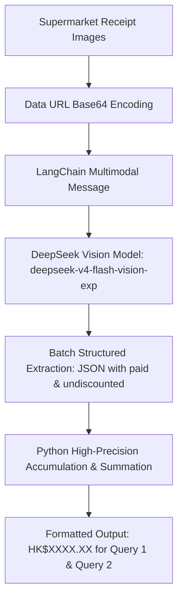

# FTEC5660 Homework 1: Receipt Chain

Build a LangChain pipeline that reads every supermarket receipt in a folder
with the vision-capable DeepSeek Flash model and answers these two questions:

1. How much money did I spend in total for these bills?
2. How much would I have had to pay without the discount?

For this homework, **amount spent** means the final payment after the receipt's
rounding line. **Without the discount** means the sum of the original positive
item prices: add back every promotion, coupon, member, app, packaging-damage,
and percentage discount, but do not add back rounding.

## Student task

Only edit the two functions in `hw1.py` that contain `### YOUR CODE HERE`:

- `build_chain()` creates your LangChain chain.
- `answer_queries()` runs the chain on the receipt images and returns one final
  response for each question.

You may use prompt chaining, routing, parallel calls, reflection, or a
combination. Your final responses should each contain one HKD amount. Do not
hard-code filenames or public answers; grading uses unseen receipt folders.

## Setup and public test

```bash
python3 -m venv .venv
source .venv/bin/activate
pip install -r requirements.txt
```

Put your DeepSeek key after `DEEPSEEK_API_KEY=` in `.env`, then run:

```bash
python3 hw1.py --image-folder public_test
```

The program creates `results.csv` in the current directory. Its columns are
`query`, `model_response`, and `correctness`. The public answers are in
`public_test/ground_truth.json`. The starter intentionally returns the dummy
response `please design your chain to answer these two queries.` so it runs
before you add any API code.

The required model is `deepseek-v4-flash-vision-exp`, the vision-capable
DeepSeek Flash model. JPEG, PNG, GIF, and WebP inputs are accepted by the
homework runner.


## Homework 1 solution: 
> to students: please fill your solution description here.
### Chain Architecture Visualization



Solution Description
My solution implements an end-to-end multimodal extraction and aggregation pipeline built with LangChain and deepseek-v4-flash-vision-exp. Instead of delegating arithmetic summation to the vision-language model across multiple receipts, I adopt a decoupled "extract-then-aggregate" architecture. For each receipt, multimodal messages containing the Base64 data URL and prompt instructions guide the vision backbone to extract two strictly defined financial fields into JSON format: the net settled amount after rounding (paid) and the pre-discount base price (subtotal plus coupons/promotions without rounding). The results are processed concurrently via batch inference, parsed defensively with JSON and regex fallbacks, and aggregated with Python's Decimal arithmetic to eliminate hallucination and rounding errors, producing exact outputs complying with the single-amount formatting requirement.

## Task 2: Reflection
### Key AI Events in the Past 10 Days
Over the past ten days leading up to late September, the artificial intelligence landscape experienced two seismic shifts:
1. **The Launch of Meta's Llama 3.2 (September 25):** Meta officially released its first open-weights multimodal models (11B and 90B Vision models) alongside lightweight edge-native architectures (1B and 3B). This brought high-performance visual document reasoning directly into open-source deployment and enterprise edge hardware.
2. **The Maturation of Reasoning Paradigms (OpenAI o1 Series & Test-Time Compute):** The widespread deployment of reasoning-centric models demonstrated that scaling inference compute ("thinking time") radically enhances step-by-step mathematical reasoning, algorithmic logic, and autonomous error-correction.
3. **The Democratization of Cost-Effective Multimodal APIs:** The release and widespread adoption of highly optimized visual models—such as the `deepseek-v4-flash-vision-exp` backbone utilized in this assignment—have reduced multimodal inference latency and costs by orders of magnitude, making real-time enterprise document pipelines economically viable.

---

### How These Events Reshaped My Perspective on FinTech
Prior to these breakthroughs, I perceived AI in financial operations primarily as specialized, brittle pipelines—relying on traditional OCR engines followed by handcrafted regular expressions or discriminative classification models. 

The events of the past ten days have fundamentally changed this viewpoint:
- **Vision is Now an Accessible System Primitive:** With Llama 3.2 and DeepSeek's rapid vision iterations, multi-format receipt interpretation, invoice parsing, and portfolio statement digitization are no longer expensive bottlenecks confined to closed-source proprietary APIs. Open multimodal intelligence has commoditized document understanding.
- **The Shift from "Prediction" to "Deterministic Verification":** Seeing reasoning models and multimodal agents interact directly with financial data highlights that pure language generation is insufficient for finance. As illustrated by this assignment, the true power lies in a hybrid paradigm: leveraging probabilistic neural models for perception and semantic understanding, while enforcing mathematical precision through deterministic symbolic tools (such as Python's Decimal arithmetic).

---

### Impact on My Career Plan
In response to these developments, I am proactively realigning my professional trajectory:
1. **From Model Fine-Tuning to Agentic System Architecture:** Rather than focusing solely on downstream fine-tuning of generic language models, I am pivoting my focus toward **Compound AI Systems and Agentic Engineering**—mastering frameworks like LangChain, tool calling, memory management, and structured schema enforcement.
2. **Specializing in Auditable & Mission-Critical FinTech Workflows:** The financial sector demands zero-tolerance for arithmetic hallucination and complete auditability. My revised career goal is to become an **AI Solutions Architect in Quantitative and Operational Finance**, designing robust, multi-agent evaluation loops where perception agents extract unstructured messy inputs, deterministic execution layers handle strict ledger calculations, and reasoning agents perform continuous compliance audits.