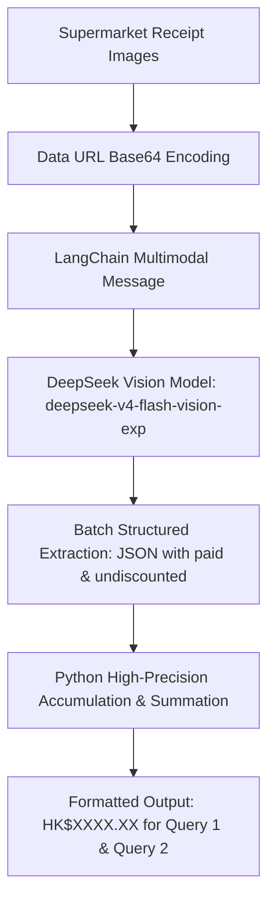

# FTEC5660 Homework 1: Receipt Chain

Build a LangChain pipeline that reads every supermarket receipt in a folder
with the vision-capable DeepSeek Flash model and answers these two questions:

1. How much money did I spend in total for these bills?
2. How much would I have had to pay without the discount?

For this homework, **amount spent** means the final payment after the receipt's
rounding line. **Without the discount** means the sum of the original positive
item prices: add back every promotion, coupon, member, app, packaging-damage,
and percentage discount, but do not add back rounding.

## Student task

Only edit the two functions in `hw1.py` that contain `### YOUR CODE HERE`:

- `build_chain()` creates your LangChain chain.
- `answer_queries()` runs the chain on the receipt images and returns one final
  response for each question.

You may use prompt chaining, routing, parallel calls, reflection, or a
combination. Your final responses should each contain one HKD amount. Do not
hard-code filenames or public answers; grading uses unseen receipt folders.

## Setup and public test

```bash
python3 -m venv .venv
source .venv/bin/activate
pip install -r requirements.txt
```

Put your DeepSeek key after `DEEPSEEK_API_KEY=` in `.env`, then run:

```bash
python3 hw1.py --image-folder public_test
```

The program creates `results.csv` in the current directory. Its columns are
`query`, `model_response`, and `correctness`. The public answers are in
`public_test/ground_truth.json`. The starter intentionally returns the dummy
response `please design your chain to answer these two queries.` so it runs
before you add any API code.

The required model is `deepseek-v4-flash-vision-exp`, the vision-capable
DeepSeek Flash model. JPEG, PNG, GIF, and WebP inputs are accepted by the
homework runner.


## Homework 1 solution: 
> to students: please fill your solution description here.
### Chain Architecture Visualization



Solution Description
My solution implements an end-to-end multimodal extraction and aggregation pipeline built with LangChain and deepseek-v4-flash-vision-exp. Instead of delegating arithmetic summation to the vision-language model across multiple receipts, I adopt a decoupled "extract-then-aggregate" architecture. For each receipt, multimodal messages containing the Base64 data URL and prompt instructions guide the vision backbone to extract two strictly defined financial fields into JSON format: the net settled amount after rounding (paid) and the pre-discount base price (subtotal plus coupons/promotions without rounding). The results are processed concurrently via batch inference, parsed defensively with JSON and regex fallbacks, and aggregated with Python's Decimal arithmetic to eliminate hallucination and rounding errors, producing exact outputs complying with the single-amount formatting requirement.

## Task 2: Reflection

The rapid acceleration of agentic and reasoning AI over the recent period—especially breakthroughs in test-time compute, reasoning-centric models (such as OpenAI o1), and efficient open multimodal architectures like DeepSeek—has fundamentally reshaped my perspective on financial technology and my long-term career planning. 

Previously, I viewed AI in FinTech primarily as an auxiliary analytical tool or specialized OCR pipeline. However, seeing modern vision-language models effortlessly perform zero-shot structured parsing, schema compliance, and document reasoning across noisy receipts has demonstrated that AI agents are transitioning from "assistants" to autonomous "knowledge workers." In quantitative finance and enterprise automation, the bottleneck is no longer raw model capability, but designing verifiable architectures: combining probabilistic neural perception with deterministic symbolic tools (such as Python Decimal arithmetic). Consequently, I am shifting my career focus from training standalone predictive models to mastering Agentic Workflow Engineering—orchestrating compound AI systems that integrate reasoning models with rigorous financial verification protocols.